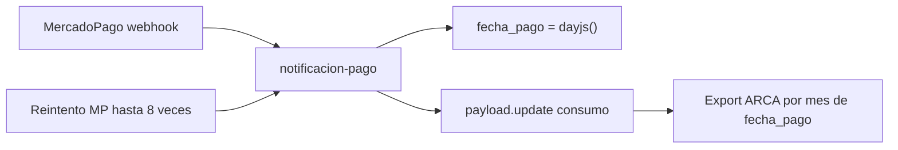

# Auditoría y corrección de fechas de pago (Consumos / ARCA)

## Decisiones confirmadas

| Tema | Decisión |
|------|----------|
| Base de datos | Dump completo de **producción** restaurado en DB de **desarrollo**. No tocar prod hasta tener causa + fix claros. |
| Fecha canónica MP | `date_approved` (sin fallback a otras fechas salvo que venga null; entonces loguear error) |
| Criterio de error | **Cualquier diferencia de día calendario** (AR) vs MP es mismatch a reportar y corregir |
| Alcance de esta pasada | Las 3: reporte + fix webhook + script de corrección (dry-run; `--apply` solo con OK explícito) |
| Liquidaciones ARCA ya presentadas | Fuera de alcance por ahora |
| Pagos manuales | Ignorar por completo |

## Diagnóstico (causa raíz)

En [`src/endpoints/notificacion-pago.ts`](src/endpoints/notificacion-pago.ts):

```24:29:src/endpoints/notificacion-pago.ts
      datos_facturacion: {
        id_pago_mp,
        precio_final,
        meses_vencido,
        fecha_pago: dayjs().toISOString(), // “ahora” del servidor, no date_approved
      },
```

1. `fecha_pago` = momento del webhook, no `date_approved`.
2. Sin idempotencia: reintentos de MP reescriben la fecha e incrementan `nro_comprobante`.
3. Docs MP: reintentos 0 min → 15 min → 30 min → 6 h → 48 h → 96 h (~8 intentos). Encaja con fechas que saltan de mes.



## Universo a auditar / corregir

- `estado: PAGADO`
- `pago_manual` no true
- `datos_facturacion.id_pago_mp` numérico (payment id MP)
- `datos_facturacion.fecha_pago` en los últimos **6 meses** (flag `--months`)

## Herramientas

| Recurso | Uso |
|---------|-----|
| MCP `notifications_history` | Corroborar fallas/reintentos de webhooks |
| MCP `search_documentation` | Ya confirmó reintentos/idempotencia |
| SDK `mercadopago` + `MP_ACCESS_TOKEN` | Bulk `Payment.get` (el MCP no expone get de pagos) |
| Skill Payload | Fix del endpoint |
| Skill Canvas | Presentar impacto del reporte |

## Fase 0 — Corroboración MCP (no bloqueante)

`notifications_history` sobre la app correspondiente. Confirmar `date_approved` en docs si hace falta.

## Fase 1 — Reporte (solo lectura sobre el dump)

Script [`scripts/audit-fecha-pago-mp.ts`](scripts/audit-fecha-pago-mp.ts): Payload Local API + SDK MP, apuntando al `.env` de desarrollo (dump).

Por cada consumo:

1. `Payment.get({ id: id_pago_mp })`
2. Comparar día en `America/Argentina/Buenos_Aires`: DB vs `date_approved`
3. Clasificar: `ok` | `mismatch` (cualquier día distinto) | `mismatch_mes` (subflag IVA) | `error_mp`

Salida: CSV/JSON en `scripts/output/` + Canvas (totales, por mes, montos con mes incorrecto).

`pnpm exec tsx scripts/audit-fecha-pago-mp.ts --months=6`

## Fase 2 — Fix webhook

En [`src/endpoints/notificacion-pago.ts`](src/endpoints/notificacion-pago.ts):

1. Si consumo ya `PAGADO` con el mismo `id_pago_mp` → `200` sin update.
2. `fecha_pago = payment.date_approved` (nunca `dayjs()`).
3. Log de reintentos ignorados.

## Fase 3 — Script de corrección

[`scripts/fix-fecha-pago-mp.ts`](scripts/fix-fecha-pago-mp.ts) (o `--apply` en el mismo script):

- Default **dry-run**
- `--apply`: setea `datos_facturacion.fecha_pago` a `date_approved` en todos los mismatches de día
- Solo sobre el dump de desarrollo hasta que se valide; prod después con dump fresco / decisión explícita
- Log de cambios; no toca `nro_comprobante` ni manuales

## Orden

1. Fase 0 + Fase 1 (reporte + Canvas) sobre el dump
2. Fase 2 (código del webhook) + Fase 3 dry-run
3. Revisar → `--apply` en el dump → validar
4. Deploy webhook a prod; corrección en prod solo cuando se decida (nuevo dump o ventana controlada)
5. Liquidaciones ARCA: pendiente, fuera de esta pasada

## Notas

- `.env` local = DB desarrollo con dump de prod + token MP real para consultar pagos.
- Timezone AR en todas las comparaciones.
- Rate-limit suave en llamadas a Payments API.
