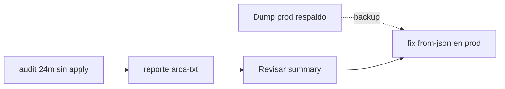

# Re-audit + fix producción (orden seguro)

## Respuesta corta sobre `.env`

**Sí, dejalo apuntando a producción** para este ciclo: el objetivo es corregir prod. El dump nuevo en [`dump-prod/`](dump-prod/) es el **respaldo** por si hay que restaurar; no hace falta cambiar `DATABASE_URI` si no vas a practicar otra vez en local.

Regla de oro: **`pnpm audit:fecha-pago` no escribe**; **`pnpm fix:fecha-pago` sí escribe** (siempre manda `--apply`). Nunca corras `fix` hasta haber revisado el summary del audit nuevo.



## Orden exacto de comandos

Trabajar desde la raíz del repo, con `MP_ACCESS_TOKEN` válido en `.env`.

### 1. No borrar evidencia vieja

Dejar intactos en [`scripts/output/`](scripts/output/) los `audit-*` / `fix-*` / `arca-txt-*` del 11-jul (base de la reconciliación ARCA ya hecha). Los comandos crean archivos **con timestamp nuevo**.

### 2. Auditoría fresca contra prod (solo lectura)

```bash
pnpm audit:fecha-pago -- --months=24
```

- Lee consumos PAGADO MP de la DB de prod.
- Consulta MercadoPago `date_approved`.
- Escribe `scripts/output/audit-fecha-pago-<stamp>.json` (+ CSV + canvas).
- **No** usa `--apply`.

Anotar la ruta del JSON nuevo (consola al final).

### 3. Regenerar reportes ARCA con el audit nuevo

Los TXT/CSV de [`reportestxtcooperativa/`](reportestxtcooperativa/) no cambian (ya presentados). Solo cambia el cruce vs MP:

```bash
pnpm reporte:arca-txt -- --from-json=scripts/output/audit-fecha-pago-<stamp>.json
```

Sobrescribe los `arca-txt-*.csv/json` actuales (mismo nombre). Si querés conservar el corte anterior, copiá antes la carpeta `scripts/output/` a un backup (ej. `scripts/output-2026-07-11/`).

### 4. Revisar antes de escribir

En consola / JSON nuevo, chequear:

- `to_fix` / `mismatch_mes` / `mismatch` (debería ser similar al audit previo + pagos del finde).
- Pagos post-webhook fix: deberían salir mayormente `ok`.
- `failed` no aplica aún (solo en el apply).

### 5. Aplicar fix en producción

Solo cuando el summary esté OK:

```bash
pnpm fix:fecha-pago -- --from-json=scripts/output/audit-fecha-pago-<stamp>.json
```

Eso escribe `fecha_pago = fecha_aprobado_mp` en prod y genera `fix-fecha-pago-applied-<stamp>.json`.

### 6. Verificación post-fix (lectura)

```bash
pnpm audit:fecha-pago -- --months=24
```

Esperado: `to_fix` cercano a 0 (salvo errores MP puntuales). Guardar este JSON como “post-fix”.

## Qué no hacer

- No correr `pnpm fix:fecha-pago` sin `--from-json` del audit **recién generado**.
- No usar el audit del 11-jul para aplicar hoy (faltan pagos del finde/semana).
- No presentar TXT a ARCA todavía (sigue el freeze administrativo).
- No borrar el dump ni los audits pre-fix.

## Nota sobre el dump local

Si más adelante querés re-probar en local: restaurá `dump-prod` en Mongo local, cambiá `DATABASE_URI` al local, y repetí audit/fix ahí. Para **este** objetivo (prod corregida), con `.env` en prod alcanza.
