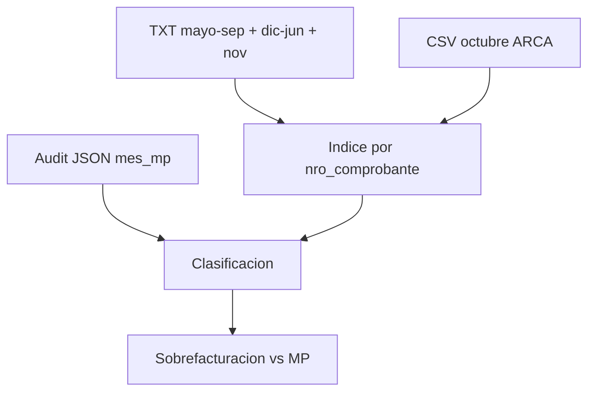

# Re-chequeo con oct/nov 2025 + sobrefacturación vs MP

## Contexto

Ya existe [`scripts/reporte-arca-txt-vs-mp.ts`](scripts/reporte-arca-txt-vs-mp.ts) + [`scripts/lib/arca-txt-parse.ts`](scripts/lib/arca-txt-parse.ts). Faltaba cobertura de **2025-10** y **2025-11**.

Archivos nuevos en [`reportestxtcooperativa/`](reportestxtcooperativa/):

| Mes     | Fuente          | Detalle                                                                                                                                                             |
| ------- | --------------- | ------------------------------------------------------------------------------------------------------------------------------------------------------------------- |
| 2025-11 | Par TXT         | `VentasComprobantes_noviembre de 2025.txt` + `VentasAlicuotas_...` (192 líneas) — el parser actual **ya los carga** al re-correr                                    |
| 2025-10 | CSV portal ARCA | `comprobantes_periodo_202510_ventas_*.csv` — 216 filas; `;` + montos `18329,84`; columnas `Número de Comprobante`, `Importe Total`, `Importe IVA 21%` / `Total IVA` |

Criterio de verdad sin cambios: una declaración por pago, en el mes de `date_approved` (`mes_mp`).

## Cambios técnicos

### 1. Parser CSV de ARCA (octubre)

En [`scripts/lib/arca-txt-parse.ts`](scripts/lib/arca-txt-parse.ts):

- Detectar archivos `comprobantes_periodo_YYYYMM_*.csv`.
- Parsear con `delimiter: ';'`, encoding `latin1`, decimal con coma.
- Mapear cada fila a la misma estructura `ArcaTxtAppearance` / mes pair:
  - `mes_archivo` = del nombre (`202510` → `2025-10`)
  - `nro_comprobante` = `Número de Comprobante`
  - `fecha_linea` = `Fecha de Emisión` → `YYYYMMDD`
  - `importe_total` / `iva` / `neto` desde columnas del CSV
  - `fuente: 'csv_arca'` (TXT queda `fuente: 'txt'`)
- Si un mes tiene **TXT y CSV**, priorizar TXT y loguear warning (hoy solo CSV en oct).
- Integrar CSV en `loadArcaTxtDirectory` para que `mesesConTxt` pase a incluir `2025-10` y `2025-11`.

### 2. Re-ejecutar reconciliación

Sin cambiar clasificaciones (`ok`, `mes_incorrecto`, `duplicado`, `faltante_en_txt`, `sin_cobertura_txt`, `solo_txt`).

Al re-correr `pnpm reporte:arca-txt`:

- Oct/nov dejan de ser “sin cobertura” para filas con `mes_mp` en esos meses.
- Regenerar todos los CSV/JSON en `scripts/output/`.

### 3. Métrica de sobrefacturación vs MercadoPago

Agregar salida [`scripts/output/arca-txt-sobrefacturacion.csv`](scripts/output/arca-txt-sobrefacturacion.csv) + bloque en el JSON maestro.

Definición concreta (acotada a meses **con evidencia ARCA**):

- **IVA declarado ARCA** = suma IVA de todas las apariciones en archivos (TXT/CSV), incluyendo duplicados.
- **IVA correcto MP** = suma IVA (fórmula export) de filas del audit con `mes_mp` en esos meses y `status !== error_mp`.
- **`delta_iva_sobre`** = `iva_declarado - iva_correcto` (positivo = sobrefacturaron ese mes / en total).
- Lo mismo para **importe bruto** y **cantidad de líneas** vs **comprobantes únicos MP**.

Desglose del exceso (para no mezclar causas):

| Componente       | Qué aporta al “de más”                                                                                            |
| ---------------- | ----------------------------------------------------------------------------------------------------------------- |
| `duplicados`     | 2ª+ presentación del mismo `nro_comprobante`                                                                      |
| `mes_incorrecto` | Presentado en mes ≠ `mes_mp` (desplaza masa entre meses; a nivel total cubierto puede compensarse)                |
| `solo_txt`       | En ARCA y no en audit MP (manuales u huérfanos) — **no es sobrefacturación vs MP de pagos MP**, se reporta aparte |
| `ok`             | No aporta exceso                                                                                                  |

El resumen total imprimirá en consola:

1. **Sobrefacturación neta vs MP** (meses con evidencia): `delta_iva` y `delta_importe`.
2. **IVA inflado por duplicados** (suma IVA de apariciones extras).
3. **Masa `solo_txt`** (excluida del veredicto “vs MercadoPago”, listada como “no auditables por MP”).

## Archivos a tocar

- [`scripts/lib/arca-txt-parse.ts`](scripts/lib/arca-txt-parse.ts) — loader CSV + `fuente`
- [`scripts/reporte-arca-txt-vs-mp.ts`](scripts/reporte-arca-txt-vs-mp.ts) — sobrefacturación + re-generación salidas
- Salidas regeneradas en `scripts/output/` (mismos nombres + `arca-txt-sobrefacturacion.csv`)

## Qué no hace

- No modifica DB ni presenta nada en ARCA.
- No trata `solo_txt` como error de sobrefacturación MP (sí lo cuantifica aparte).
- No inventa el TXT de octubre: el CSV del portal es la evidencia de lo declarado en 2025-10.

## Criterio de éxito

- `meses_con_txt` incluye `2025-10` y `2025-11`; `meses_sin_txt_en_rango` vacío en mayo 2025–junio 2026.
- Duplicados / mes incorrecto / faltantes recalculados con cobertura completa.
- Un número claro de **delta IVA ARCA − MP** (y desglose) respondiendo si sobrefacturaron.
