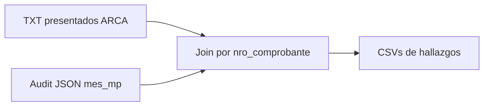

# Reconciliación TXT presentados vs MercadoPago

## Criterio de verdad (confirmado)

- **Correcto:** cada pago MP se declara **una sola vez**, en el mes calendario de `date_approved` (`mes_mp` en AR, desde la auditoría).
- **Declarado:** lo que figura en los TXT de [`reportestxtcooperativa/`](reportestxtcooperativa/) (archivos **exactamente presentados** a ARCA).
- **Mal:** aparece en mes ≠ `mes_mp`, aparece más de una vez, o no aparece cuando debería (dentro de meses con TXT).

## Fuentes

| Fuente                      | Archivo                                                                                                                          | Rol                                                 |
| --------------------------- | -------------------------------------------------------------------------------------------------------------------------------- | --------------------------------------------------- |
| TXT presentados             | [`reportestxtcooperativa/`](reportestxtcooperativa/) — 12 pares Comprobantes+Alícuotas                                           | Lo declarado en ARCA                                |
| Auditoría MP pre-fix        | [`scripts/output/audit-fecha-pago-2026-07-11T19-20-40-879Z.json`](scripts/output/audit-fecha-pago-2026-07-11T19-20-40-879Z.json) | `nro_comprobante`, `mes_mp`, `precio_final`, status |
| Export (referencia formato) | [`src/views/export-registros/client-export-registros.tsx`](src/views/export-registros/client-export-registros.tsx)               | Layout fixed-width + fórmula IVA                    |

**Cobertura TXT:** mayo 2025 → junio 2026 **sin octubre ni noviembre 2025**. Esos dos meses quedan como _sin evidencia de presentación_ (no se inventan datos).

**Fuera de alcance MP:** pagos manuales (están en TXT, no en el JSON de auditoría). Se listan aparte, sin juzgar mes vs MP.

## Enfoque concreto

Script nuevo [`scripts/reporte-arca-txt-vs-mp.ts`](scripts/reporte-arca-txt-vs-mp.ts) + lib [`scripts/lib/arca-txt-parse.ts`](scripts/lib/arca-txt-parse.ts):

1. **Parsear** todos los `VentasComprobantes_*.txt` y `VentasAlicuotas_*.txt`:
   - Mes declarado = mes del nombre del archivo (`mayo de 2025` → `2025-05`), no la fecha de la línea.
   - Clave = `nro_comprobante` (posiciones 16–35 en Comprobantes; 8–27 en Alícuotas).
   - Montos: total / neto / IVA en centavos → pesos (misma escala que el export).
2. **Cargar** el JSON de auditoría con `loadAuditRowsFromJson` (ya existe en [`scripts/lib/fecha-pago-mp.ts`](scripts/lib/fecha-pago-mp.ts)).
3. **Indexar** TXT por `nro_comprobante` → lista de apariciones `{mes_archivo, fecha_linea, importe, iva}`.
4. **Clasificar** cada comprobante:

| Clasificación       | Condición                                                                                                    |
| ------------------- | ------------------------------------------------------------------------------------------------------------ | -------------------------- | ------- |
| `ok`                | Exactamente 1 aparición en TXT y `mes_archivo === mes_mp`                                                    |
| `mes_incorrecto`    | Exactamente 1 aparición y `mes_archivo !== mes_mp`                                                           |
| `duplicado`         | 2+ apariciones en TXT (ya hay ~25 confirmados, ej. feb+mar 2026)                                             |
| `faltante_en_txt`   | Está en audit con `mes_mp` en un mes **con** TXT, pero no aparece en ningún TXT                              |
| `sin_cobertura_txt` | Está en audit con `mes_mp` en oct/nov 2025 (u otro mes sin archivo) — no se marca como error de presentación |
| `solo_txt`          | Está en TXT y no en audit (típico: pago manual)                                                              |
| `monto_distinto`    | Match por número pero `                                                                                      | importe_txt - precio_final | > 0.01` |

Para `duplicado`: si alguna de las apariciones cae en `mes_mp`, marcar también `incluye_mes_correcto: true/false` (útil para el contador: a veces el problema es solo la segunda presentación).

5. **Resumen mensual** (solo meses con TXT + fila de meses sin TXT):
   - IVA declarado (suma Alícuotas del archivo)
   - IVA que debió ir a ese mes (suma audit con `mes_mp = mes`)
   - `delta_iva`, counts por clasificación
   - count de duplicados que tocan ese mes

## Salidas en `scripts/output/`

- `arca-txt-resumen-mensual.csv` — vista principal para el contador
- `arca-txt-duplicados.csv` — cada `nro_comprobante` con todos los meses donde apareció + `mes_mp`
- `arca-txt-mes-incorrecto.csv` — una sola presentación, mes equivocado
- `arca-txt-faltantes.csv` — debían estar en un mes con TXT y no están
- `arca-txt-sin-cobertura.csv` — `mes_mp` en oct/nov 2025 (u otros sin archivo); informativo
- `arca-txt-solo-txt.csv` — en TXT, no en audit MP (manuales / huérfanos)
- `arca-txt-reconciliacion.json` — totales + paths

Comando: `pnpm reporte:arca-txt` apuntando por defecto al JSON 24m y a `reportestxtcooperativa/`.

## Validaciones del script

- Cada par Comprobantes/Alícuotas del mismo mes: misma cantidad de líneas y mismos `nro_comprobante`.
- Largo de línea fijo (266 / 62) — fallar fuerte si un archivo no matchea.
- Unicidad de `nro_comprobante` en el JSON de auditoría; si hay dupes internos, reportarlos aparte.
- Loguear meses faltantes detectados (hoy: `2025-10`, `2025-11`).

## Qué no hace

- No modifica DB ni re-presenta en ARCA.
- No asume contenido de oct/nov 2025.
- No trata pagos manuales como error vs MP (solo listado).
- No usa el estado post-`--apply` como verdad de lo presentado (los TXT son pre-corrección / lo realmente subido).

## Criterio de éxito

- Lista cerrada de duplicados confirmados en TXT con su `mes_mp`.
- Lista de presentaciones únicas en mes ≠ `mes_mp`.
- Resumen mensual IVA declarado vs IVA correcto (MP), acotado a meses con TXT.
- Explicitar el hueco oct/nov 2025 para el contador.
