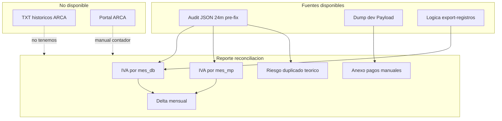
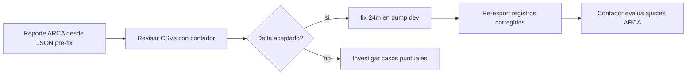

# Plan: Reconciliación contra ARCA (sin TXT históricos)

## Decisiones confirmadas

| Tema | Tu respuesta |
|------|----------------|
| TXT subidos a ARCA | **No los tenés guardados** |
| Fuente de fechas | **JSON 24m pre-corrección** ([`scripts/output/audit-fecha-pago-2026-07-11T19-20-40-879Z.json`](scripts/output/audit-fecha-pago-2026-07-11T19-20-40-879Z.json)) — refleja lo que la DB tenía al exportar |
| Fix `--apply` | Corrió solo sobre auditoría de **6 meses** (1.187 registros); el JSON de 24m **no fue modificado** por el fix |
| Pagos manuales | Fuera de la auditoría MP; hay **37** consumos manuales PAGADO en 24m que el export ARCA **sí incluye** |

## Qué podemos probar y qué no (sin dar nada por sentado)

**Podemos estimar con alta confianza:**
- Qué IVA **debió liquidarse** por mes según `date_approved` de MP (`mes_mp`).
- Qué IVA **se habría liquidado** con las fechas incorrectas en DB (`mes_db`), replicando la lógica de [`client-export-registros.tsx`](src/views/export-registros/client-export-registros.tsx).
- Qué comprobantes (`nro_comprobante`) están en el **mes equivocado** (845 con cambio de mes).
- El **delta mensual** de IVA mal ubicado.

**No podemos probar sin más datos:**
- Qué se **presentó efectivamente** en ARCA (no hay TXT ni export del portal).
- Si un mismo `nro_comprobante` fue **subido dos veces** en dos meses distintos (escenario de doble IVA que describiste). Solo podemos marcar **riesgo teórico**: comprobantes cuyo `mes_db ≠ mes_mp` y que podrían haber sido re-exportados tras cambio de `fecha_pago`.
- Si el contador ajustó algo manualmente fuera del sistema.



## Cómo funciona hoy el export ARCA (referencia obligatoria)

En [`client-export-registros.tsx`](src/views/export-registros/client-export-registros.tsx):

1. **Filtro por mes**: consumos `PAGADO` con `datos_facturacion.fecha_pago` en `[inicio_mes, inicio_mes_siguiente)` — **incluye pagos manuales**.
2. **Fecha en el TXT**: primeros 8 chars = `YYYYMMDD` derivados de `new Date(fecha_pago)` con `getFullYear/getMonth/getDate` (**timezone del navegador**, no `America/Argentina/Buenos_Aires` explícito).
3. **Clave del comprobante**: `nro_comprobante` (único en la colección).
4. **IVA**: `round(precio_final / 1.21)` neto + diferencia = IVA liquidado (misma fórmula en `createAlicuotas`).

El reporte debe **replicar exactamente** esa fórmula de IVA ([`round` de `@/utils/math`](src/utils/math.ts)) para que los montos coincidan con lo que generaba el admin.

**Atención timezone:** la auditoría compara días en AR (`formatDayAR` en [`scripts/lib/fecha-pago-mp.ts`](scripts/lib/fecha-pago-mp.ts)); el export usa `Date` local. El plan incluye una validación cruzada: para una muestra de filas, comparar `mes_db` del audit vs mes que saldría con la lógica del export — y documentar si hay casos borde (cerca de medianoche UTC).

## Datos de entrada del reporte

| Input | Archivo / origen | Uso |
|-------|------------------|-----|
| Auditoría MP 24m | [`audit-fecha-pago-2026-07-11T19-20-40-879Z.json`](scripts/output/audit-fecha-pago-2026-07-11T19-20-40-879Z.json) | 2.520 filas MP; 2.130 con mismatch |
| Pagos manuales | Query Payload al dump dev | 37 consumos; anexo separado |
| Filas `ok` (390) | Del mismo JSON | `mes_db === mes_mp`; no generan delta |

Resumen conocido del JSON (mismatches):

- `mismatch` (mismo mes, día distinto): **1.285**
- `mismatch_mes` (cambió el mes): **845** — **impacto principal en liquidación mensual IVA**

## Fase 1 — Librería compartida de cálculo ARCA

Crear [`scripts/lib/arca-export-math.ts`](scripts/lib/arca-export-math.ts) extrayendo (sin duplicar lógica de negocio distinta):

- `calcIvaDesdePrecioFinal(precio_final)` — neto + IVA como en `createAlicuotas`
- `mesCalendarioDesdeFechaPago(iso, mode: 'ar' | 'local')` — dos modos para comparar audit vs export
- `parseNroComprobanteFromVentasLine(line)` — parser del TXT por si en el futuro aparecen archivos (offset fijo: posición 16, largo 20, según `createComprobantes`)
- Constantes: `TIPO 018`, `PUNTO_VENTA 00002`, `ALICUOTA 0005`

Reutilizar tipos `AuditRow` desde [`scripts/lib/fecha-pago-mp.ts`](scripts/lib/fecha-pago-mp.ts) (`loadAuditRowsFromJson` ya existe).

## Fase 2 — Script principal de reconciliación

Nuevo script: [`scripts/reporte-arca-reconciliacion.ts`](scripts/reporte-arca-reconciliacion.ts)

```bash
pnpm reporte:arca -- --from-json=scripts/output/audit-fecha-pago-2026-07-11T19-20-40-879Z.json
```

Agregar script en [`package.json`](package.json): `"reporte:arca": "node --env-file=.env --import tsx scripts/reporte-arca-reconciliacion.ts"`

### Salidas en `scripts/output/` (todas CSV + un JSON maestro)

**1. `arca-resumen-mensual.csv`** — tabla principal para el contador

Columnas por mes calendario `YYYY-MM`:

| Columna | Significado |
|---------|-------------|
| `mes` | Mes calendario |
| `comprobantes_declarados` | Count filas audit con `mes_db = mes` |
| `iva_declarado` | Suma IVA usando `mes_db` |
| `comprobantes_correctos` | Count filas con `mes_mp = mes` |
| `iva_correcto` | Suma IVA usando `mes_mp` |
| `delta_iva` | `iva_declarado - iva_correcto` (positivo = pagaron de más ese mes) |
| `delta_comprobantes` | diferencia de cantidad |

Incluir fila **TOTAL** y meses solo en un lado (ej. comprobantes que “salieron” de nov 2025 y “entraron” en dic 2025).

**2. `arca-matriz-shift.csv`** — cruces mes declarado → mes correcto

Para cada par `mes_db -> mes_mp` (solo `mismatch_mes`):

- `count`, `sum_precio_final`, `sum_iva`, lista top 5 `nro_comprobante` de ejemplo

Ejemplo ya visible en datos: `2025-12 -> 2025-11` con 171 comprobantes (~$782k IVA).

**3. `arca-comprobantes-cambio-mes.csv`** — detalle de los 845 casos críticos

Columnas: `nro_comprobante`, `titulo`, `periodo_normalizado`, `mes_db`, `mes_mp`, `dia_db`, `dia_mp`, `precio_final`, `iva`, `id_pago_mp`, `consumo_id`

Ordenado por `mes_db`, luego `nro_comprobante`.

**4. `arca-comprobantes-mismo-mes.csv`** — los 1.285 con día distinto pero mismo mes

Menor impacto en liquidación mensual IVA, pero fecha del comprobante en TXT incorrecta. Útil si ARCA cruza por fecha exacta.

**5. `arca-riesgo-duplicado-teorico.csv`** — sin TXT, solo hipótesis

Para cada `nro_comprobante` con `mes_db ≠ mes_mp`:

- `mes_declarado_probable` = `mes_db`
- `mes_correcto` = `mes_mp`
- `escenario`: texto fijo explicando que si exportaron `mes_db` y luego la fecha cambió y re-exportaron `mes_mp`, el mismo número podría figurar dos veces
- **No afirmar duplicado confirmado** — marcar `confirmado: no`

**6. `arca-manuales.csv`** — anexo desde DB

Query Payload: `PAGADO` + `pago_manual: true` + `fecha_pago` últimos 24 meses.

Columnas: mismas que exportaría ARCA (`nro_comprobante`, fecha, precio, IVA, mes).

Estos **no están en el JSON de auditoría MP** pero **sí entran al libro de ventas** cuando exportan.

**7. `arca-reconciliacion.json`** — resumen machine-readable con totales y paths de CSVs.

### Lógica de agregación (precisa)

Para cada fila del audit con `status !== 'error_mp'` y `precio_final` numérico:

```ts
const iva = calcIvaDesdePrecioFinal(precio_final)
// Sumar a bucket mes_db  -> "declarado"
// Sumar a bucket mes_mp  -> "correcto"
```

Filas `ok`: contribuyen igual a ambos buckets del mismo mes (delta 0).

Filas `mismatch` / `mismatch_mes`: contribuyen a meses distintos → generan delta en dos meses.

**No incluir** filas sin `fecha_aprobado_mp` (0 en tu JSON).

## Fase 3 — Validaciones internas del script

Antes de escribir CSVs, el script debe verificar y loguear:

1. **Cierre de masa**: suma de `iva_declarado` y `iva_correcto` sobre todos los meses debe ser **igual** (mismos comprobantes, solo reubicados).
2. **Consistencia con audit summary**: `to_fix` del JSON = filas con delta distinto de cero.
3. **Muestra timezone**: 20 filas donde `mes_db` (AR) ≠ mes según `Date` local — listar en consola si existen.
4. **nro_comprobante únicos**: no debe haber duplicados en el JSON (si los hay, reportar aparte — sería otro bug).

## Fase 4 — Canvas de reconciliación ARCA

Generar [`canvases/arca-reconciliacion.canvas.tsx`](canvases/arca-reconciliacion.canvas.tsx) (skill Canvas) con:

- Gráfico de barras: `iva_declarado` vs `iva_correcto` por mes
- Gráfico: `delta_iva` por mes (destacar meses con IVA “inflado”)
- Stats: total delta IVA acumulado, count cambio de mes
- Tabla top shifts (`2025-12 -> 2025-11`, etc.)

Datos embebidos desde el JSON maestro generado por el script.

## Fase 5 — Guía para verificación manual en ARCA (entregable markdown en consola, no archivo .md salvo que pidas)

Al finalizar el script, imprimir checklist para el contador:

1. Entrar a ARCA → Libro IVA Digital / Régimen de información (según su régimen).
2. Por cada mes con `|delta_iva|` alto en `arca-resumen-mensual.csv`, comparar **IVA débito fiscal** del período con columna `iva_declarado`.
3. Meses con delta negativo en M y positivo en M+1: típico del shift +1 mes (ej. pagos de nov declarados en dic).
4. Si en el futuro encuentran TXT: re-correr con flag `--txt-dir=/ruta` (dejar preparado el parser en la lib, **no ejecutar** hasta que tengan archivos).

## Fase 6 — Qué NO hace este plan (explícito)

- No modifica la DB (solo lectura del dump para manuales).
- No re-presenta ni corrige liquidaciones en ARCA.
- No reemplaza asesoramiento contable/legal.
- No aplica `--apply` de fechas (eso es un paso separado, previo a re-exportar registros corregidos).

## Orden de ejecución recomendado



1. Correr `pnpm reporte:arca` sobre JSON 24m.
2. Revisar `arca-resumen-mensual.csv` y `arca-comprobantes-cambio-mes.csv` con contador.
3. **Recién después** decidir `pnpm fix:fecha-pago -- --months=24 --from-json=...` en dump dev.
4. Deploy fix webhook a prod + corrección prod cuando corresponda.
5. Contador define si hay que rectificar períodos en ARCA (fuera de alcance técnico).

## Riesgos y limitaciones a documentar en el reporte

| Riesgo | Mitigación |
|--------|------------|
| Export usa TZ del navegador, audit usa AR | Validación muestra en Fase 3 |
| No sabemos cuándo exportaron cada mes | Reporte refleja estado de fechas en DB al momento del audit, no historial de exports |
| Pagos manuales (37) no auditados vs MP | Anexo `arca-manuales.csv` |
| Doble IVA no confirmable | Archivo `arca-riesgo-duplicado-teorico.csv` con disclaimer |
| `periodo_normalizado` del consumo ≠ mes de pago | El export usa `fecha_pago`, no período de lectura — el reporte no mezcla esas dimensiones |

## Archivos a crear/modificar

| Archivo | Acción |
|---------|--------|
| [`scripts/lib/arca-export-math.ts`](scripts/lib/arca-export-math.ts) | Crear |
| [`scripts/reporte-arca-reconciliacion.ts`](scripts/reporte-arca-reconciliacion.ts) | Crear |
| [`package.json`](package.json) | Agregar `reporte:arca` |
| [`scripts/lib/fecha-pago-mp.ts`](scripts/lib/fecha-pago-mp.ts) | Reutilizar `loadAuditRowsFromJson` (sin cambios salvo exportar helpers si hace falta) |
| Canvas ARCA | Generar al correr el script |

## Criterios de éxito

- CSV mensual con delta IVA por mes listo para el contador.
- Lista completa de 845 comprobantes con cambio de mes.
- Masa de IVA conservada (declarado total = correcto total).
- Canvas visual con meses más afectados.
- Checklist impreso para verificación manual en portal ARCA.
