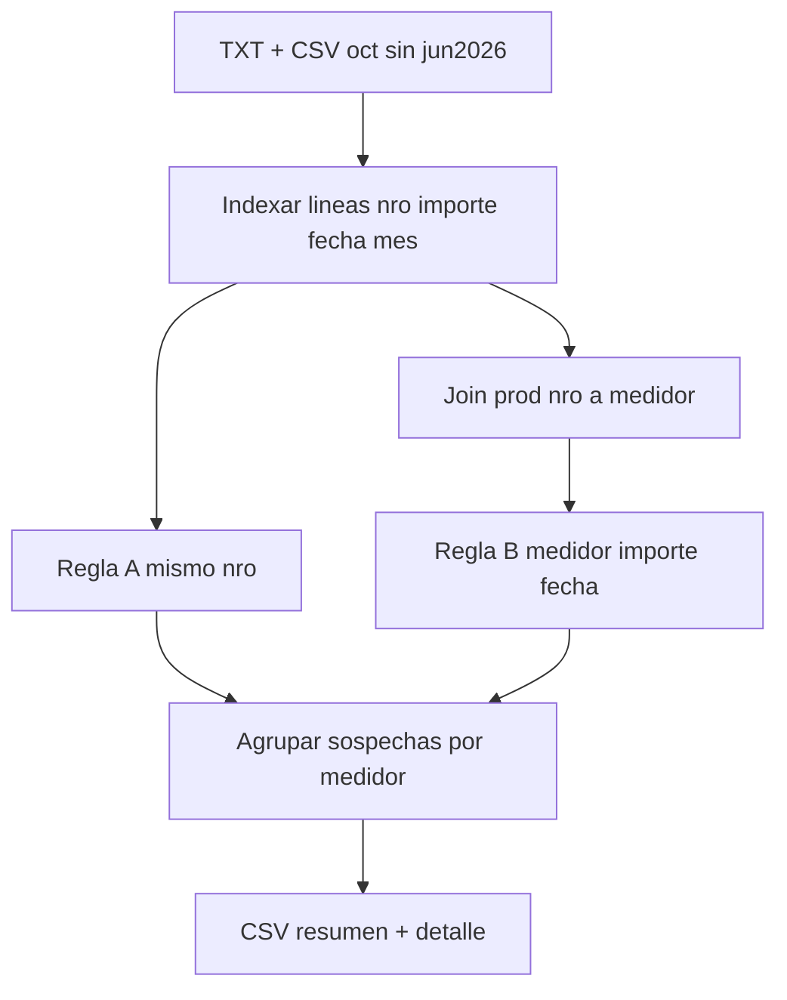

# Reporte de repeticiones ARCA por medidor

## Objetivo

Recorrer lo **efectivamente presentado** a ARCA, marcar ventas sospechosas de repetición, resolver a qué **medidor** corresponden (prod actual) y entregar un listado **por medidor** con todas sus sospechas (puede haber muchas por medidor).

## Alcance de archivos

Incluir todo lo de [`reportestxtcooperativa/`](reportestxtcooperativa/) **excepto junio 2026**:

- Todos los pares `VentasComprobantes_*` / `VentasAlicuotas_*` con `mes_archivo !== 2026-06`
- El CSV de octubre 2025 (`comprobantes_periodo_202510_...csv`)

Parser existente: [`scripts/lib/arca-txt-parse.ts`](scripts/lib/arca-txt-parse.ts) (`loadArcaTxtDirectory`).

## Criterio de sospecha (confirmado)

Una presentación (línea ARCA) es sospechosa si cumple **al menos una** de estas reglas:

| Regla                        | Condición                                                                                                                                                                                 |
| ---------------------------- | ----------------------------------------------------------------------------------------------------------------------------------------------------------------------------------------- |
| **A – mismo comprobante**    | Mismo `nro_comprobante` en 2+ meses/archivos                                                                                                                                              |
| **B – mismo hecho de venta** | Mismo `medidor` + mismo `importe_total` + misma `fecha_linea` (fecha del comprobante en el archivo ARCA, `YYYYMMDD`), en 2+ líneas presentadas (aunque el `nro_comprobante` sea distinto) |

Notas:

- La fecha de comparación es la **fecha impresa en la línea presentada** (`fecha_linea`), no el mes del nombre de archivo.
- Regla B requiere join a medidor; líneas huérfanas (nro sin consumo en prod) solo pueden entrar por regla A.
- Un mismo grupo puede matchear A y B; se reporta una vez con `motivos` (`nro_duplicado`, `medidor_importe_fecha`).

## Join a medidor (prod actual)

`DATABASE_URI` = **prod actual** (solo lectura).

Cadena: `nro_comprobante` → `consumos` → `medidor` → `usuario` (nombre, apellido, cuit) + `numero_medidor`, `direccion`.

## Salidas (organizadas por medidor)

En [`scripts/output/`](scripts/output/):

1. **`arca-repeticiones-por-medidor.csv`** — una fila por medidor con al menos una sospecha:
   - `medidor_id`, `numero_medidor`, `direccion`
   - cliente: `nombre`, `apellido`, `cuit`
   - `ventas_sospechosas` (cantidad de líneas ARCA en grupos sospechosos)
   - `repeticiones_extra` (suma de `tamaño_grupo - 1` por grupo atribuido a ese medidor; “cuántas de más”)
   - `nros_involucrados`, `meses_tocados` (resumen)

2. **`arca-repeticiones-detalle.csv`** — una fila por línea sospechosa (un medidor puede tener muchas):
   - datos del medidor/cliente
   - `nro_comprobante`, `importe_total`, `fecha_linea`, `mes_archivo`, `archivo`
   - `motivos`, `grupo_id`, `apariciones_en_grupo`

3. **`arca-repeticiones-huerfanos.csv`** — sospechas regla A cuyo nro no resuelve a consumo en prod

4. **`arca-repeticiones.json`** — totales + paths

Orden: medidores por `repeticiones_extra` descendente; dentro del detalle, por medidor y `fecha_linea`.

## Script

Nuevo [`scripts/reporte-repeticiones-arca.ts`](scripts/reporte-repeticiones-arca.ts) + `pnpm reporte:repeticiones-arca`.

Pasos:

1. `loadArcaTxtDirectory` → filtrar `mes_archivo !== '2026-06'`.
2. Indexar apariciones por `nro_comprobante` → regla A.
3. Payload prod: resolver nros presentes a medidor/usuario.
4. Agrupar líneas resueltas por clave `(medidor_id, importe_total, fecha_linea)` → regla B si `size >= 2`.
5. Unificar grupos, atribuir a medidor, escribir CSVs.

No modifica DB ni regenera TXT.

## Criterio de éxito

- Junio 2026 no aparece en ningún output.
- Los ~31 `nro_comprobante` ya vistos como duplicados entran por regla A.
- Regla B suma casos con nros distintos pero mismo medidor+importe+fecha.
- Un medidor con varias sospechas lista **todas** en el detalle, no solo un resumen.
