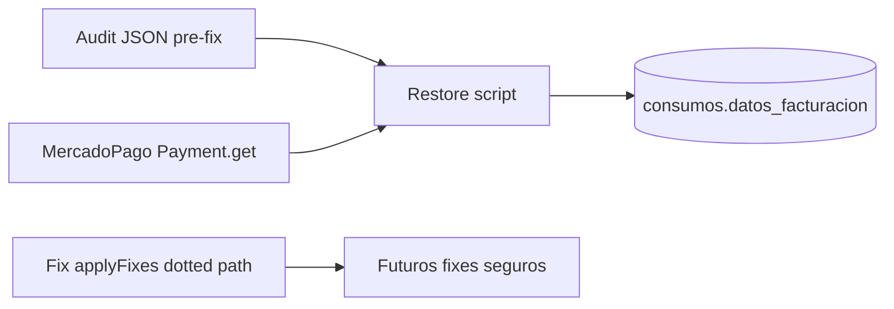

# Restaurar datos de facturación (consumos PAGADO sin MP)

## Hallazgos ya confirmados

**Sí: los 4 fueron modificados por el fix de producción** (`pnpm fix:fecha-pago`, 13-jul-2026, 3.317 aplicados). Están en [`scripts/output/fix-fecha-pago-applied-2026-07-13T15-53-45-028Z.json`](scripts/output/fix-fecha-pago-applied-2026-07-13T15-53-45-028Z.json) y en el audit previo [`scripts/output/audit-fecha-pago-2026-07-13T15-29-32-693Z.json`](scripts/output/audit-fecha-pago-2026-07-13T15-29-32-693Z.json):

| consumo_id                 | id_pago_mp   | nro_comprobante | precio_final | fecha_pago corregida |
| -------------------------- | ------------ | --------------- | ------------ | -------------------- |
| `67ce48c04510cafbffb0f805` | 129550500088 | 3652            | 387112.63    | 2025-10-11           |
| `67a3cc767688d6b7d1f2b4f1` | 133779484812 | 4280            | 320988.53    | 2025-11-14           |
| `67ce4da3e6705fde98a8f258` | 133219821821 | 4285            | 438113.20    | 2025-11-14           |
| `67edd46dd78083b92545eda0` | 133829155372 | 4286            | 372365.50    | 2025-11-14           |

**Causa probable del vacío:** en [`scripts/lib/fecha-pago-mp.ts`](scripts/lib/fecha-pago-mp.ts) `applyFixes` hace:

```ts
data: {
  datos_facturacion: { fecha_pago: row.fecha_aprobado_mp! },
}
```

Payload MongoDB `$set` eso como objeto anidado → **reemplaza todo el grupo** `datos_facturacion`, borrando `id_pago_mp`, `precio_final`, `meses_vencido` y tarifas. `estado`, `nro_comprobante` y `precio_final` top-level no fueron tocados por el script.

El post-audit de 395 OK no contradice esto: solo mira pagos con `id_pago_mp` en ventana de 6 meses; los 3.317 corregidos quedaron fuera de ese filtro o sin `id_pago_mp`.



## Alcance elegido

1. **Diagnosticar** en la DB apuntada por `.env` cuántos `PAGADO` no-manuales tienen `datos_facturacion` incompleto (sin `id_pago_mp` o sin `precio_final` en el grupo).
2. **Restaurar primero estos 4**, verificando cada pago en MercadoPago.
3. **Si el wipe es masivo**, restaurar el resto de los 3.317 usando el audit JSON (misma fuente de verdad) + MP para `meses_vencido` / validación.
4. **Corregir el bug** en `applyFixes` para que nunca vuelva a pasar.

## Implementación

### 1. Script de diagnóstico + restore

Nuevo script tipo [`scripts/restore-datos-facturacion-mp.ts`](scripts/restore-datos-facturacion-mp.ts) (dry-run por defecto, `--apply` para escribir):

- Leer filas del audit pre-fix (o lista fija de IDs).
- Para cada consumo: `findByID` y reportar estado actual de `datos_facturacion` / `nro_comprobante` / `precio_final`.
- Con `Payment.get({ id })` de MercadoPago validar `status === 'approved'`, `metadata.consumo_id`, y tomar:
  - `id_pago_mp` = payment.id
  - `fecha_pago` = `date_approved`
  - `precio_final` = `metadata.precio_final` ?? `transaction_amount`
  - `meses_vencido` = `metadata.meses_vencido`
- Completar `nro_comprobante` / `precio_final` top-level desde audit si faltan.
- **Update seguro** con paths planos (no reemplazar el grupo entero), p.ej. merge explícito del objeto `datos_facturacion` existente + campos de pago, vía `payload.db.updateOne` con el documento mergeado completo del grupo (o `$set` de campos individuales si el adapter lo permite).
- Preservar tarifas existentes si todavía están; si el grupo quedó solo con `fecha_pago`, restaurar al menos los campos de pago (suficientes para ARCA/export).

Salida: CSV/JSON en `scripts/output/` + npm scripts `audit:datos-facturacion` / `fix:datos-facturacion`.

### 2. Fix preventivo en `applyFixes`

Cambiar el update a merge seguro, p.ej. leer el consumo, setear solo `datos_facturacion.fecha_pago` sobre el objeto existente, y escribir el grupo completo mergeado (o usar update con path `datos_facturacion.fecha_pago` si el transform de Payload lo soporta). Nunca pasar `{ datos_facturacion: { fecha_pago } }` solo.

### 3. Ejecución

1. Dry-run de los 4 → confirmar wipe vs. otra causa.
2. Dry-run de conteo global de `PAGADO` sin `id_pago_mp`.
3. `--apply` de los 4 tras revisión.
4. Si el conteo global es alto, `--apply` del resto desde el audit JSON (mismo flujo).
5. Re-leer los 4 docs para verificar.

**Nota:** hace falta `MP_ACCESS_TOKEN` y DB de prod (o dump) en `.env`. El MCP de MercadoPago está sin auth; usaremos el SDK ya usado en el repo (`mercadopago`), no el MCP.

## Qué no hace este plan

- No reasigna `nro_comprobante` nuevos (usa los del audit).
- No re-exporta ARCA automáticamente.
- No toca pagos manuales.
